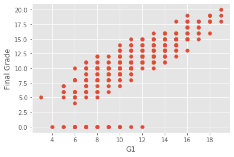
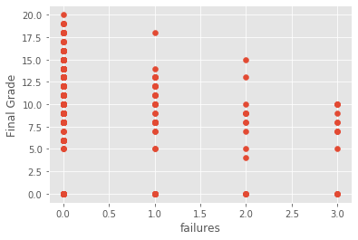

# Student Performance Visualizer and Predictor
A machine learning model to predict and visualize student performances in school based on several attributes. I was able to get the accuracy of this model to about 92%. The data I used to train the model can be found here: https://archive.ics.uci.edu/ml/datasets/Student+Performance

# Repository Contents
- studentPerformance.ipynb contains the Python code for this model. I have commented all the logic going on so it's easier to understand and follow. I also have graphs with matplotlib to visualize the data and see the correlation between the label and it's attributes. 
- Along with my notebook, I have two csv files which contain the data for students performances based on all 33 attributes. 
- student.txt contains all the attributes and the number/string values associated with them.
- student_model.pickle is a pickle file I made in my Python program to store the model with my highest accuracy. 

# Linear Regression Examples

     

